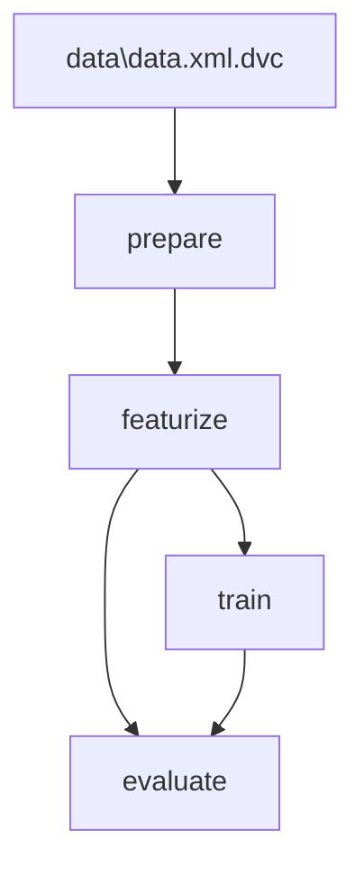

```mermaid
flowchart TD
	node1["data\data.xml.dvc"]
	node2["evaluate"]
	node3["featurize"]
	node4["prepare"]
	node5["train"]
	node1-->node4
	node3-->node2
	node3-->node5
	node4-->node3
	node5-->node2
```